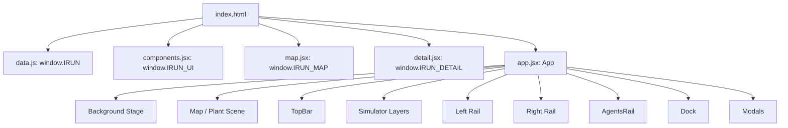

# iRun 平台结构分析

更新日期：2026-06-30

分析版本：`c8d6626 Add interactive operations big screen`

运行方式：静态站点，`python3 -m http.server 8080`

## 1. 总体结论

当前 iRun 是一个「固定 1920 x 1080 设计稿比例」的纯静态 React/Babel 大屏应用。它没有构建流程，所有依赖通过 `index.html` 直接加载，业务数据和组件都挂在 `window.IRUN*` 全局命名空间下。

平台现在已经从单纯的「数字运维工作台」升级成双层产品形态：

- **新版形态：iRun AI 运维经理模拟器**
  - 默认开启。
  - 用 S1-S10 场景导演轨串起“雇佣数字团队、事件触发、多 Agent 协同、经理决策、托管电站、闭环汇报”。
  - 主要组件是 `ScenarioDirectorRail`、`ManagerDecisionConsole`、`DigitalTeamOrgPanel`、`MissionFeedbackLayer`、`OperationsBigScreenLayer`。

- **旧版形态：数字孪生运维工作台**
  - 通过 Legacy / 旧版按钮切回。
  - 仍保留事件流、对话调度、Agent 竖栏、Token 面板、单站多 Agent 场地布场、UAV 巡检。
  - 主要组件是 `EventStream`、`DispatchPanel`、`AgentTokenPanel`、`PlantInlineDock`、`PlantAgentField`。

一句话概括：**中间大屏舞台和电站背景仍是底座，外层交互正在从“人操作系统”转为“人管理数字团队”。**

## 2. 代码与资源结构

### 2.1 入口与加载顺序

`index.html` 同时承担页面入口、全局 CSS 和脚本加载。

脚本加载顺序：

```text
index.html
  -> vendor/three.min.js
  -> vendor/react.development.js
  -> vendor/react-dom.development.js
  -> vendor/babel.min.js
  -> vendor/marked.min.js
  -> vendor/purify.min.js
  -> data.js
  -> fetch.js
  -> tokenData.js
  -> agentTokenData.js
  -> components.jsx
  -> map.jsx
  -> scene3d.jsx
  -> detail.jsx
  -> app.jsx
```

关键点：

- `data.js` 先挂载 `window.IRUN`。
- `components.jsx` 挂载 `window.IRUN_UI`。
- `map.jsx` 挂载 `window.IRUN_MAP`。
- `detail.jsx` 挂载 `window.IRUN_DETAIL`。
- `scene3d.jsx` 挂载 `window.IRUN_SCENE3D`。
- `app.jsx` 最后读取这些全局对象并渲染 React 根组件。

### 2.2 主要文件职责

| 文件 | 职责 |
| --- | --- |
| `index.html` | 页面入口、全局样式、脚本加载、布局层 CSS |
| `app.jsx` | 应用根组件、全局状态、页面模式切换、总览/电站渲染编排 |
| `components.jsx` | 顶栏、左右面板、Agent 竖栏、模拟器面板、机器人、弹窗等通用 UI |
| `map.jsx` | `PlantsMap` 抽象地图和 `Map2Overlay` 实景背景 pin 层 |
| `detail.jsx` | 单电站详情、单站底部 dock、场景步进 hook、单站协同图谱 |
| `scene3d.jsx` | 3D 场景模式 |
| `data.js` | 租户、电站、Agent、场景 A/B、模拟器 S1-S10、决策卡等核心数据 |
| `fetch.js` | 电站列表、KPI、告警等接口适配与字段归一 |
| `tokenData.js` | 单电站 Token 消耗数据 |
| `agentTokenData.js` | Agent Token 数据 |
| `assets/app/backgrounds/` | 通用背景图 |
| `assets/app/sites/` | 总览页实景/装置背景 |
| `assets/app/plants/` | 单电站现场背景 |
| `assets/app/videos/` | 漫游与演示视频 |
| `docs/` | 规划、规格和对话素材 |

## 3. 全局运行模型

### 3.1 核心渲染树



### 3.2 核心状态

| 状态 | 所在 | 作用 |
| --- | --- | --- |
| `plants` | `app.jsx` | 当前电站列表，会被接口数据覆盖部分字段 |
| `tenantIdx` | `app.jsx` | 当前租户 |
| `focusId` / `focusPlant` | `app.jsx` | 当前聚焦电站，决定是否进入单站页 |
| `viewMode` | `app.jsx` | 当前视图，主要是 `map2` 总览和 `img2` 单站 |
| `map2SubMode` | `app.jsx` | 总览背景子模式，亮色图 / 暗色展示 / 漫游视频 |
| `theme` / `lang` | `app.jsx` | 主题和语言，写入 `localStorage` |
| `simulatorEnabled` | `app.jsx` | 是否启用 AI 运维经理模拟器，默认开启 |
| `simSceneId` | `app.jsx` | 当前 S1-S10 模拟器场景 |
| `simDecisionId` | `app.jsx` | S7 经理决策结果 |
| `simScore` | `app.jsx` | 安全、效率、自治、收益评分 |
| `simBadges` | `app.jsx` | 模拟器成就反馈 |
| `simAutonomyLevel` | `app.jsx` | S9 托管等级 |
| `scenarioIdx` | `app.jsx` | 单站自动场景 A/B |
| `mode` | `app.jsx` | 单站 `auto` 或 `command` |
| `busyMap` | `app.jsx` | 当前活跃 Agent，高亮现场机器人和协同线 |
| `dispatchCollapsed` / `streamCollapsed` | `app.jsx` | 旧版左右面板折叠状态 |
| `selectedAgent` / `openAgent` | `app.jsx` | 当前选择/打开的 Agent |
| `overviewBots` | `app.jsx` | 总览页派遣机器人队列 |
| `dispatchedRobots` | `app.jsx` | 单站指挥模式派遣机器人队列 |

### 3.3 数据流

1. 页面加载后，先使用 `data.js` 的本地模拟数据。
2. `app.jsx` 调用 `window.IRUN_FETCH.getPlantList()` 获取电站列表，按 id 覆盖名称和 KPI 字段。
3. 点击总览电站 pin 时，调用 `getPlantAlarmList()` 和 `getPlantKpi()` 更新当前电站告警、风险和 KPI。
4. 单站自动模式由 `useScenarioStepping()` 根据 `SCENARIOS` 推进步骤，并通过 `onStep()` 写入 `busyMap`。
5. 模拟器模式由 `SIMULATOR_SCENES`、`SIMULATOR_DECISIONS` 和 `simulatorState` 驱动，不依赖旧版对话调度。

## 4. 平台页面分层

平台不是传统多路由应用，而是一个大屏容器内的多层条件渲染。

从底到顶可以分为：

1. **背景层**
   - `.scene`
   - `.grid-bg`
   - `.scan`
   - `.vignette`
   - `.scene-img-bg`
   - `.scene-video-bg`

2. **空间舞台层**
   - 总览：`Map2Overlay`
   - 单站：电站背景图 + `PlantAgentField` / `PlantRobot` / `DispatchedRobots`
   - 旧 3D：`Scene3D`

3. **全局信息层**
   - `TopBar`
   - `MissionFeedbackLayer`

4. **主叙事层**
   - 新版：`OperationsBigScreenLayer`
   - 旧版：`Map2Overlay` + 事件流 + 调度面板

5. **左右控制层**
   - 新版左侧：`ScenarioDirectorRail`
   - 新版右侧：`ManagerDecisionConsole`
   - 旧版左侧：`EventStream`
   - 旧版右侧：`DispatchPanel`

6. **组织与工具层**
   - `AgentsRail`
   - 新版底部：`DigitalTeamOrgPanel`
   - 旧版总览底部：`AgentTokenPanel`
   - 旧版单站底部：`PlantInlineDock`

7. **弹窗层**
   - `AgentModal`
   - `SkillModal`
   - `PlantDetail`，目前主要用于非 `img2/map2` 的旧视图。

## 5. 总览页结构

### 5.1 进入条件

总览页的核心条件是：

```js
viewMode === 'map2' && !focusPlant
```

模拟器开启时，S1、S2、S10 默认也回到总览舞台。

### 5.2 总览页组件树

```text
App
  .workbench
    .scene
    .scene-img-bg / .scene-video-bg
    Map2Overlay
    OverviewDispatchRobot[]
    .map2-toggle
    TopBar
    MissionFeedbackLayer               # simulator only
    OperationsBigScreenLayer            # simulator only
    .stage
      .left-rail
        ScenarioDirectorRail            # simulator
        EventStream / EventStreamTab     # legacy
      .center-stretch
      .right-rail
        ManagerDecisionConsole           # simulator
        DispatchPanel / DispatchTab      # legacy
    AgentsRail
    .dock
      DigitalTeamOrgPanel                # simulator
      AgentTokenPanel                    # legacy overview
    AgentModal / SkillModal
```

### 5.3 背景与地图

总览页使用 `map2SubMode` 决定背景：

| 条件 | 背景 |
| --- | --- |
| `theme === 'light' && map2SubMode === 'pic1'` | `assets/app/sites/rjgf005.png` |
| `theme === 'light' && map2SubMode === 'pic2'` | `assets/app/sites/rjgf004.png` |
| `theme === 'dark' && map2SubMode === 'show'` | `assets/app/sites/rjgf001.png` |
| `theme === 'dark' && map2SubMode === 'roam'` | `assets/app/videos/manyou001.mp4` |

`Map2Overlay` 的职责：

- 过滤当前租户下有 `mapX/mapY` 的电站。
- 渲染电站 pin、状态文案、功率和告警状态。
- 在展示/图片模式下渲染 3 个巡逻机器人。
- 点击 pin 后调用 `onFocus(plant.id, plant)`，进入单站页。

### 5.4 新版模拟器总览

默认 `simulatorEnabled = true`，总览页会叠加新版模拟器。

主要结构：

- `MissionFeedbackLayer`
  - 当前场景编号。
  - 当前任务目标。
  - 场景进度。
  - 综合评分。
  - 托管等级。
  - 成就数量和 toast。

- `OperationsBigScreenLayer`
  - S1：东盟世界待机态。
  - S2：人才市场 + 雇佣。
  - S10：拉回东盟总部。
  - 也承载 S7、S9 的大屏交互卡片。

- `ScenarioDirectorRail`
  - S1-S10 场景列表。
  - 当前场景标题、一句话、目标和进度。
  - 上一幕、下一幕、触发告警、经理模式、启动托管。
  - Legacy / 旧版切换入口。

- `ManagerDecisionConsole`
  - 当前任务。
  - 证据链。
  - S6 分歧仲裁。
  - S7 决策卡。
  - S8 闭环汇报。
  - S9 托管滑杆。

- `DigitalTeamOrgPanel`
  - 数字团队组织视图。
  - 按管理型、流程型、专家型、工具型分组。
  - 展示参与闭环 / 待命状态、经理评分、成就反馈。

### 5.5 旧版总览

关闭模拟器后，总览页回到旧版工作台结构：

- 左侧：`EventStream`。
- 右侧：`DispatchPanel`。
- 底部：`AgentTokenPanel`。
- 最右：`AgentsRail`。
- 中央：`Map2Overlay`。

旧版总览的核心交互：

- 点击电站 pin 进入单站页。
- 在 `DispatchPanel` 中选择 Agent 并输入指令。
- 若指令能识别到当前租户电站名，则生成 `OverviewDispatchRobot`，从右下角走向对应电站 pin。
- 切换租户会清空聚焦电站、回到总览并召回派遣机器人。

### 5.6 总览页当前优点

- 保留了高冲击力的全屏背景和 pin 体系。
- 新旧两套产品形态可以切换，便于对照演示。
- S1-S10 场景已经有数据和基础交互。
- 经理决策、托管等级、评分和成就已经形成闭环雏形。

### 5.7 总览页当前风险

- 新版模拟器层和旧版工作台层同时存在，信息密度容易过高。
- `OperationsBigScreenLayer` 直接叠在中央舞台上，需要控制遮挡，避免盖住原本要保留的背景主体。
- `Map2Overlay` 与模拟器总览都在表达“世界/电站在线”，叙事职责有重叠。
- 背景模式命名同时存在 `pic1/pic2/show/roam/pic3/vid3`，后续最好收敛成明确枚举。
- 总览页交互入口很多：pin、导演轨、经理台、底部按钮、Agent 竖栏、旧版调度，需要定义讲解员优先路径。

## 6. 电站页结构

### 6.1 进入条件

电站页的核心条件是：

```js
viewMode === 'img2' && focusPlant
```

进入方式：

- 点击总览 `Map2Overlay` 的电站 pin。
- `TopBar` 选择电站。
- 模拟器场景 S3-S9 设置了 `focusPlantId` 后，由 `useEffect` 自动切到 `img2`。

### 6.2 电站页组件树

```text
App
  .workbench.img2-focused
    .scene
    .scene-img-bg                       # plant image
    TopBar                              # focusPlant mode
    MissionFeedbackLayer                # simulator only
    OperationsBigScreenLayer            # simulator only
    .stage
      .left-rail
        ScenarioDirectorRail            # simulator
        EventStream / EventStreamTab     # legacy rules
      .right-rail
        ManagerDecisionConsole           # simulator
        DispatchPanel / DispatchTab      # legacy rules
    AgentsRail
    DroneFlight                         # optional
    PlantAgentField                     # auto + robotField
    DispatchedRobots                    # command mode
    PlantRobot                          # fallback single robot
    .dock
      DigitalTeamOrgPanel                # simulator
      PlantInlineDock                    # legacy plant page
    AgentModal / SkillModal
```

### 6.3 背景与现场层

电站页背景由当前电站在 `plants` 中的序号计算：

```js
assets/app/plants/plant${index + 1}${theme === 'light' ? 'qian' : ''}.png
```

含义：

- 亮色主题使用 `plant0XXqian.png`。
- 暗色主题使用 `plant0XX.png`。
- 如果没有聚焦电站，则退回 `assets/app/backgrounds/img2.jpg`。

注意：这个映射依赖 `plants` 的顺序。若接口返回顺序改变或未来要动态增删电站，建议改成每个电站显式配置 `bgLight` / `bgDark`。

### 6.4 单站模式

单站页有两个旧版模式：

| 模式 | 条件 | 现场表现 |
| --- | --- | --- |
| `auto` | 自动托管 | `PlantAgentField` 根据场景步骤高亮多 Agent |
| `command` | 人工指挥 | `DispatchedRobots` 生成机器人执行气泡 |

模式规则：

- 有演示配置的电站会固定自动模式，不允许切到 command。
- 普通电站进入后默认 command。
- 当前代码里标准电站的 dock 模式按钮被锁定显示为指挥模式。

### 6.5 PlantAgentField

`PlantAgentField` 是电站页最重要的现场表达层。

职责：

- 读取 `plant.robotField` 中的 Agent 坐标。
- 过滤未配备或 `anchorOnly` 的机器人。
- 根据 `busyMap` 判断当前活跃 Agent。
- 根据当前步骤 `cur.from` 和 `cur.to` 绘制协同连线。
- 用流动粒子表达 Agent 间任务交接。
- 在当前发言 Agent 上显示执行气泡。
- UAV 步骤不在该层画连线，由 `DroneFlight` 独立表现。

### 6.6 DroneFlight

`DroneFlight` 用于无人机巡检表现。

触发方式：

- `AgentsRail` 中点击 UAV。
- 特定演示电站进入 `img2 + auto` 后自动循环。

相关状态：

- `droneFlying`
- `uavDemoLoop`
- `onDroneFlightDone`

### 6.7 PlantInlineDock

旧版电站页底部是 `PlantInlineDock`。代码注释写的是 6-card dashboard，但当前实际渲染 5 个卡片：

1. `PIDCardKpi`
   - 电站名称、区域、容量、实时功率。
   - 日发电、告警、PR。
   - 模式按钮。
   - 演示电站时间线。

2. `PIDCardTeam`
   - 10 个智能体配备状态。
   - 工作中、待处理、就绪、未配备。
   - 支持演示电站隐藏未配备 Agent。

3. `PIDCardLog`
   - 当前场景已发生步骤。
   - from -> to 的多 Agent 协同日志。
   - 根据步骤时间自动滚动。

4. `PIDCardScene`
   - 缩略版协同图谱。
   - PV 阵列、热点、修复状态、Agent 节点、协同连线。
   - 有 `robotField` 时根据真实现场坐标扩展展示。

5. `PIDCardToken`
   - 单站 Token 今日消耗。
   - calls/h。
   - 成功率。
   - 小趋势图。

### 6.8 useScenarioStepping

`useScenarioStepping()` 是单站自动演出的核心 hook。

输入：

- `scenarioIdx`
- `plantId`
- `mode`
- `onStep`
- `onScenarioChange`

行为：

- 只有存在 `plantId` 且 `mode === 'auto'` 时运行。
- 从步骤 0 开始，按 `step.t` 设置多个 `setTimeout`。
- 每步触发 `onStep(step, i, scenario)`。
- `onStep` 在 `app.jsx` 中写入 `busyMap`。
- 非演示电站结束后会在 A/B 场景间循环。

### 6.9 电站页当前优点

- 现场层和底部 dock 已能清楚表现多 Agent 协同。
- 演示电站和普通电站有不同逻辑，适合展会脚本。
- `PlantAgentField`、`PIDCardScene`、`PIDCardLog` 三者形成了“现场动作 + 缩略图谱 + 文本日志”的三重表达。
- 指挥模式的派遣机器人能把右侧输入和现场动作连接起来。

### 6.10 电站页当前风险

- 单站背景按数组序号映射，数据顺序变动会导致背景错配。
- 模拟器开启时，`DigitalTeamOrgPanel` 会替代 `PlantInlineDock`，这让电站页原有 KPI/日志/Token 细节被隐藏。
- 旧版 `PlantInlineDock` 和新版 `ManagerDecisionConsole` 都在表达任务状态，信息职责需要再切分。
- `mode`、`scenarioIdx`、`simSceneId` 三套状态同时影响单站表现，后续增加场景时要避免状态互相覆盖。
- `PlantDetail` 仍存在，但主路径已改为 inline dock，需确认是否继续维护。

## 7. 模拟器 S1-S10 与页面关系

| 场景 | 页面形态 | 关键组件 |
| --- | --- | --- |
| S1 东盟世界待机态 | 总览页 | `OperationsBigScreenLayer`、`Map2Overlay`、`ScenarioDirectorRail` |
| S2 人才市场 + 雇佣 | 总览页 | `OperationsBigScreenLayer` 的团队包卡片 |
| S3 现场态 | 电站页 | `PlantAgentField`、`DigitalTeamOrgPanel` |
| S4 事件触发 | 电站页 | `ManagerDecisionConsole`、事件卡、协同线 |
| S5 多 Agent 协同 | 电站页 | `PlantAgentField`、`ManagerDecisionConsole` |
| S6 分歧仲裁 | 电站页 | `ManagerDecisionConsole` 的仲裁模块 |
| S7 当一天经理 | 电站页 / 大屏交互 | 经理决策卡、评分变化 |
| S8 闭环汇报 | 电站页 | 闭环报告、评分、成就 |
| S9 托管电站 | 电站页 / 仪式态 | 托管滑杆、时间加速、年度收益 |
| S10 拉回东盟总部 | 总览页 | 总部收尾、经验回流、公司层结果 |

## 8. 关键交互路径

### 8.1 默认模拟器路径

```text
页面加载
  -> simulatorEnabled = true
  -> S1 总览待机
  -> 导演轨下一幕
  -> S2 人才市场
  -> S3 自动聚焦电站并进入 img2
  -> S4/S5/S6 事件与协同演出
  -> S7 经理决策
  -> S8 闭环汇报
  -> S9 托管电站
  -> S10 回到总览
```

### 8.2 旧版总览到电站

```text
总览 map2
  -> 点击 Map2Overlay pin
  -> 写入 dispatchPlantCtx
  -> setFocusId(id)
  -> setViewMode('img2')
  -> 拉取告警和 KPI
  -> 进入单站页
```

### 8.3 旧版指挥派遣

```text
选择 Agent
  -> DispatchPanel 自动 @Agent
  -> 输入指令
  -> command 模式: onDispatchCommand()
  -> DispatchedRobots 出现在单站现场
```

### 8.4 总览派遣机器人

```text
DispatchPanel 识别 @机器人 + 电站名
  -> onDispatchToPlant()
  -> overviewBots 追加任务
  -> OverviewDispatchRobot 从右下角走向 pin
  -> 换站或召回时原路返回
```

## 9. 后续规划建议

### 9.1 先明确主产品形态

现在平台同时保留模拟器和旧版工作台。建议明确：

- 展会/演示默认只走模拟器。
- 旧版作为隐藏调试或 Legacy 模式。
- README 和文档中把二者定位讲清楚，避免后续开发重复建设。

### 9.2 拆分中央舞台与解释面板

中央大屏应尽量只保留：

- 背景。
- 电站位置。
- 事件波纹。
- Agent 行动轨迹。
- 协同连线。
- 关键结果。

解释性内容更多放到：

- 左侧导演轨。
- 右侧经理台。
- 底部组织面板。

### 9.3 收敛状态模型

建议未来把以下状态合成一个更清晰的状态机：

```js
{
  page: 'overview' | 'plant',
  productMode: 'simulator' | 'legacy',
  sceneId: 'S1',
  focusPlantId: null,
  plantMode: 'auto' | 'command',
  scenarioId: 'A',
  managerDecision: null,
  autonomyLevel: 2
}
```

这样可以减少 `viewMode`、`focusId`、`simSceneId`、`scenarioIdx`、`mode` 多处互相影响的问题。

### 9.4 把背景配置从数组顺序改为显式字段

建议在 `PLANTS` 中增加：

```js
{
  bgLight: 'assets/app/plants/plant001qian.png',
  bgDark: 'assets/app/plants/plant001.png',
  mapBg: 'assets/app/sites/rjgf005.png'
}
```

这样后续接口数据和电站排序变化不会导致背景错配。

### 9.5 逐步模块化 CSS

`index.html` 中 CSS 体量已经较大，建议至少按章节加目录或拆分为：

- `base.css`
- `layout.css`
- `overview.css`
- `plant.css`
- `simulator.css`
- `modals.css`

在继续大量改造前，先做 CSS 分区会降低后续维护成本。

## 10. 当前适合下一步做的文档

建议继续补三份更细的规划文档：

1. `docs/overview-page-interaction-spec.md`
   - 专门定义总览页 S1/S2/S10、背景切换、pin、总部态和人才市场。

2. `docs/plant-page-interaction-spec.md`
   - 专门定义 S3-S9、电站现场、经理决策、托管滑杆和闭环报告。

3. `docs/simulator-state-machine-spec.md`
   - 专门定义统一状态机，避免后续功能继续散落在多个状态变量里。
